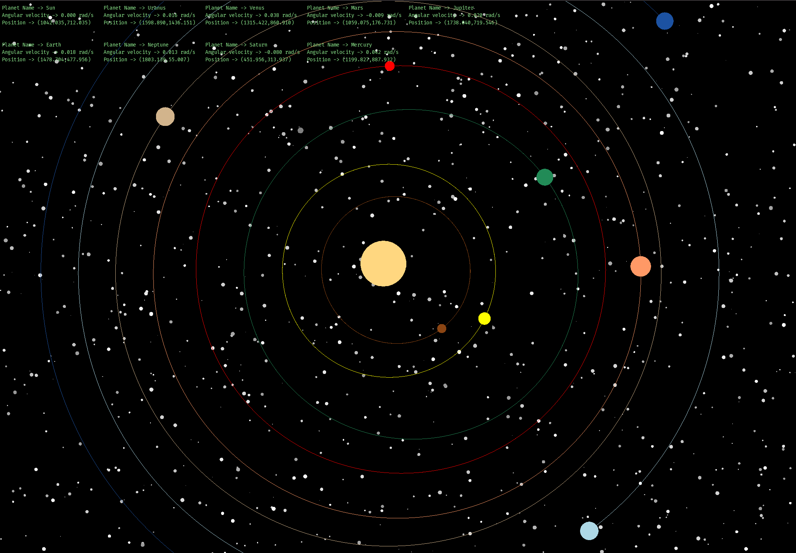

# Cloth Simulation

The project is simulating the mechanism of Newton's gravitational law of gravity. Therefore, this program will use the model of our solar system by implementing his lovely formula to the implementation with SFML.

$$
F = G \frac{m_1 m_2}{r^2}
$$

$$
F = m \cdot a_{\text{gravity}}
$$

**F** = Gravitational Force (newtons, N)

**G** = Gravitational Constant

$$
G \approx 6.674 \times 10^{-11} \, \text{Nm}^2/\text{kg}^2
$$

**m₁, m₂** = Masses of the two objects (kilograms, kg)  
**r** = Distance between the centers of the two masses (meters, m)

## Framework

The project is written with C++ and SFML framework. Check the following page for SFML documentation https://www.sfml-dev.org/

## Development guideline

Note: The program is written in with Mac OS machine, thus Windows guideline is not available yet.

### Pre-requisite

- Install Homebrew by following the documentation here: https://brew.sh/
- When Homebrew installation is complete you should be able to execute execute `brew -v`
- Install SFML with Homebrew by executing the following command. `brew install sfml`
- During installation, Homebrew may give information about required dependencies. Then follow the instruction to install those dependencies with homebrew.

### Development

- Run `brew info sfml` to confirm installation and grab the file path to sfml assets installed from homebrew
- Run `cp .env.example .env`, and replace the `SFML_PATH` value with the path you retrieved from the previous step.
- If running the code with VSCode run `cp .vscode/c_cpp_properties.example.json .vscode/c_cpp_properties.json` and replace `SFML_PATH` similar from previous step

### Running Simulation

- Execute `make clean && make && ./a.out`

### Snapshot

